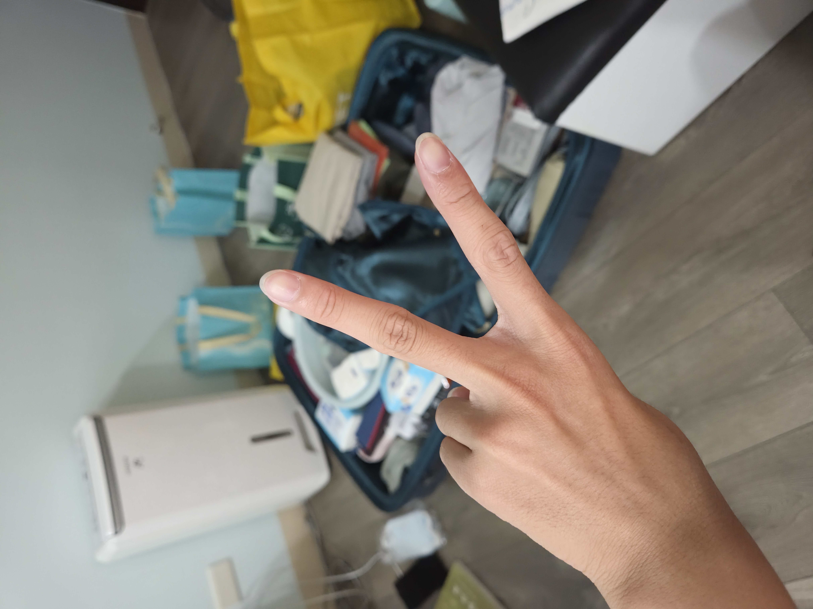
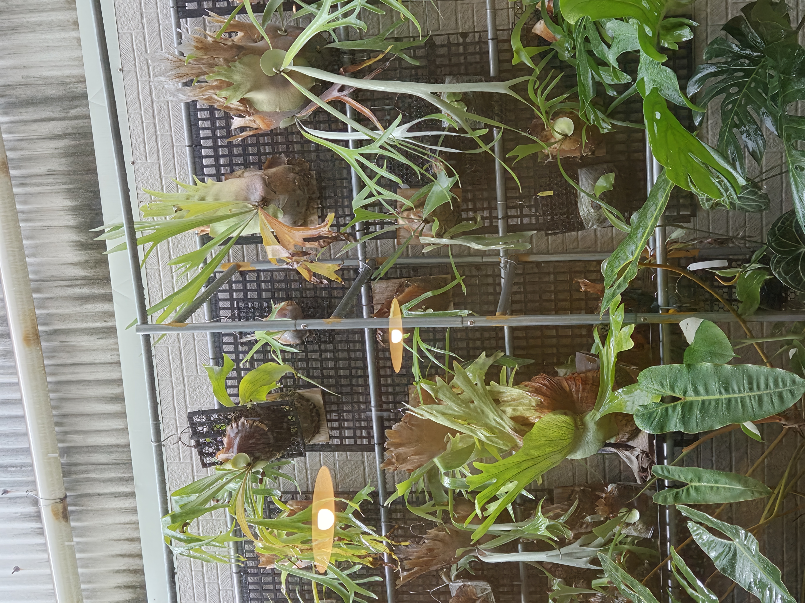
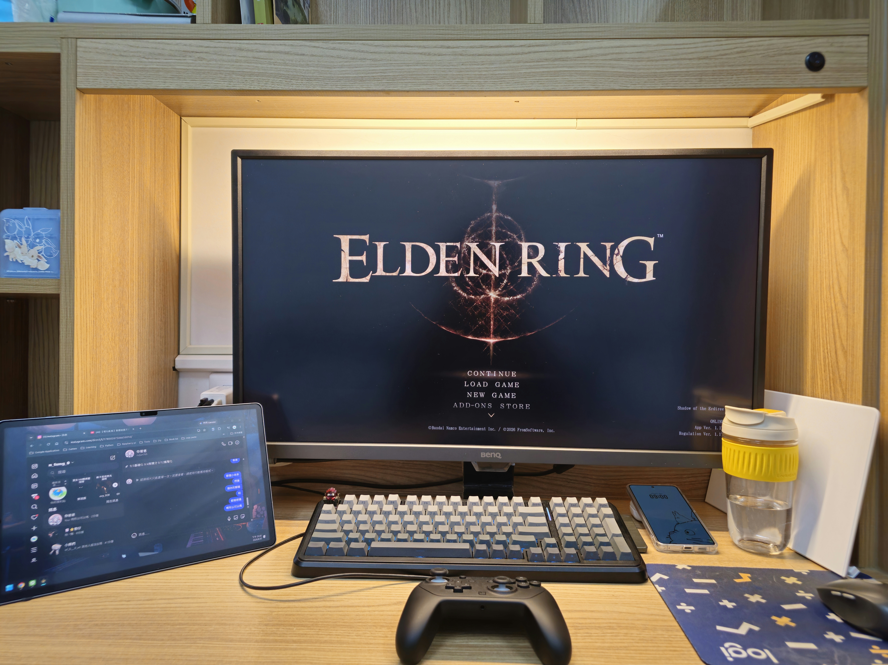

# 今天是大學的第一天 ! !
昨天九點還是十點的時候就睡了導致我三點就起床了，洗完澡去煮了咖哩麵來吃，當作離開家裡的最後一餐，早上收拾完行李出門，放完行李去吃了一家只有三杯杏鮑菇好吃的店

這間店因為不少人預約，所以我們去的時候雖然沒人卻還要等半小時，我們就去旁邊的大賣家買宿舍缺少的廁所垃圾桶以及地墊，結果回去的時候室友也在同一時間買了垃圾桶和地墊，真的是。。。

下午跟著鄭睿鈞、楊昊恩、陳宥霖去到處逛找東西吃，路上遇到一家全家，楊昊恩買了一支冰淇淋，結果他不吃就變成我的了，又走了一大段路去吃大賣家的麥當勞，回程的時候在路上路過一個奇怪的阿嬤，他坐在輪椅上嘴裡好像不斷的在念著什麼，往前走了一下後，陳宥霖突然說那個阿嬤好像找我們要幹嘛，說什麼什麼橋頭怎樣怎樣的，我原本想說房，猶豫和討論了一下下後，我回頭去問那個阿嬤幹嘛，原來他想請我們幫忙把他推到橋頭，其實看得出楊昊恩一副三小的表情，但是鄭睿鈞和陳宥霖卻是慶幸我們又回去問那個阿嬤幹嘛，他們兩個是善良的人，值得深交啊。

回到宿舍我就邊收東西邊聽宿舍的說明會直播，過了一段漫長的時光後我就開始玩艾爾登法環

我大概打了一個小時的接肢後終於打贏了，洗完澡後刷個牙也差不多要睡了，現在是12:37，晚安。

對了，是說我到現在都不知道我的室友叫做什麼名字，我對他的了解就只有是桃園來的還有是個重度二遊玩家 (´-ι_-｀)  ，但至少他人很好（吧？

希望真的如此，因為他看起來有點邋遢，那傳個照片給媽媽我就要戴上耳機等待進入夢鄉了，good night

附上room tour

12:52