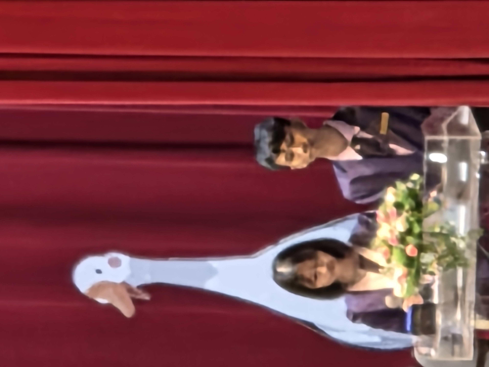
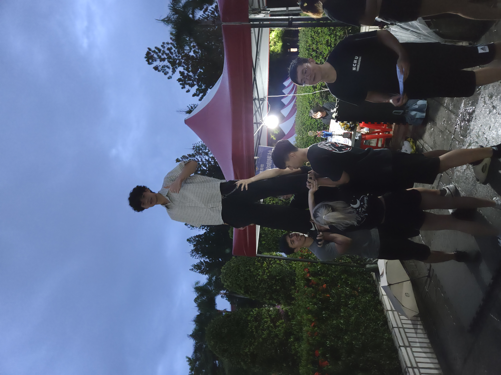
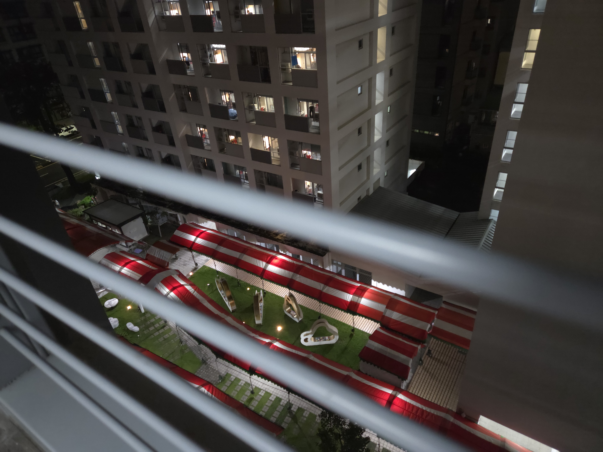
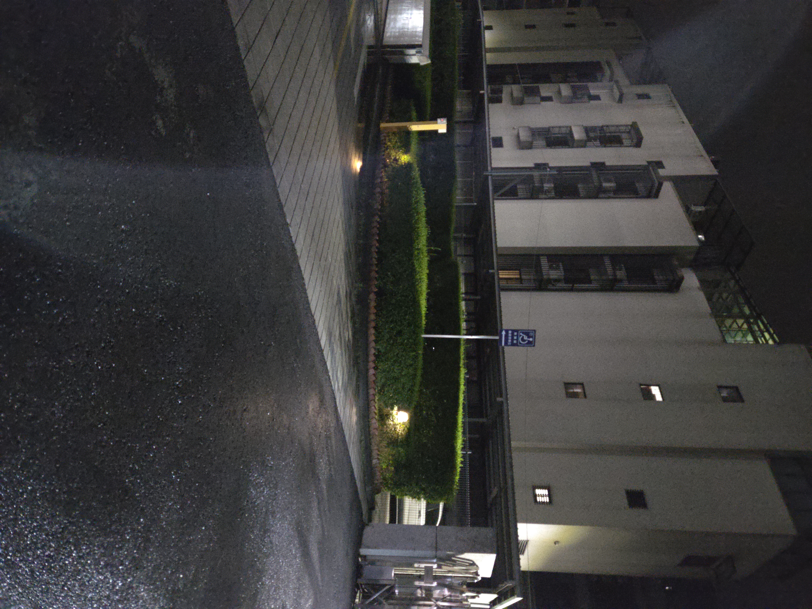
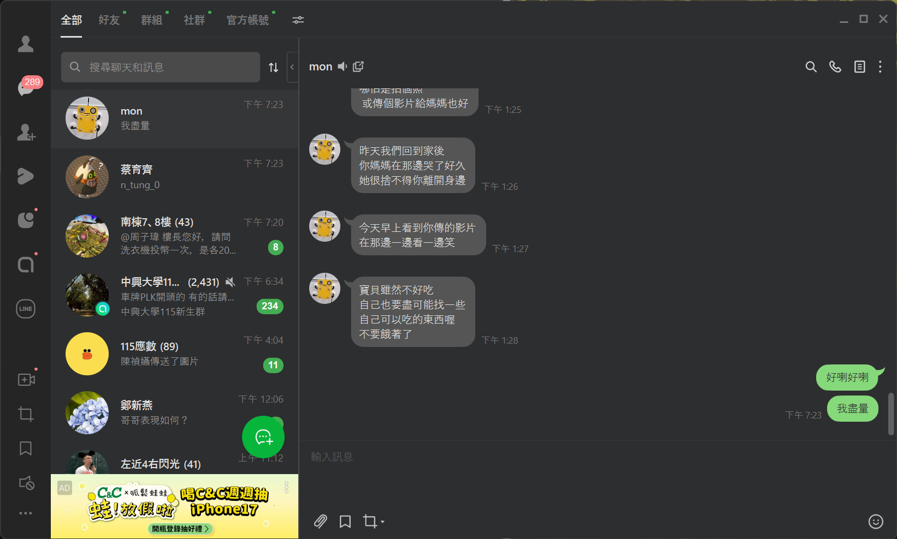

## 第一次晚上關燈打日記，希望沒有打擾到室友
今天一早大概5點就起來了，但是就處於一個辦睡辦醒的狀態直到差不多6點的時候，被提早打通電的燈嚇醒，有了今天的教訓，明天要記得先關燈 ( 但是今天還沒12點室友就已經躺上床睡了 ) ，起床後簡單的整理自己等待早上的防災演習，7點20消防緊報響起，樓長來敲門，我們也乖乖的跑了下去，但其實根本就可以翹掉啊 ! 下次知道了，嘻嘻。

防災我就跟著他們去吃美芝城，我點了個薯餅和豆漿，中規中矩，好吃。接著就是罰站點名，走大老遠到那個什麼什麼堂聽演講大部分都超無聊然後我一直在睡覺，但是有看到老哥，他真的蠻強的

中午陪著他們去丼飯，那裡有免費飲料可以喝，超爽der。

第一天學校的活動終於結束，在晚上晚上的社博之前，我們先去附近找吃的，跟著他們沿著校門口正對面走了一小段路，他們決定要去吃鴨肉飯，超級臭的 <(＿　＿)> ，我也因為這樣戴了口罩，但好事是他們只吃了十幾分鐘，超快的哈哈哈。

緊接著我們就一起逛社博，說實話社博我覺得蠻無聊的，但也還是發生了一些有趣的事，林恩立跑來把他的名片塞給我，鄭睿鈞去打拳和當啦啦隊，楊昊恩去跳飛盤，大致上看都沒有我有興趣的，頂多就是射箭社有一些興趣，但我總感覺一定會有軟研社，所以我就去看前面的總覽，看到有資訊科學研究射在第13攤擺攤，想說那就勉強去吧，總不可能沒社團吧。不看還好一看嚇一跳，他們是教資安的太棒了吧，我原本才打算自學，現在有人教了ヾ(≧▽≦*)o 。

逛玩回來洗個澡後去洗了第一次衣服，我差點把烘衣機當洗衣機用，好險室友因為自己的衣服還在洗，跑出來看我為什麼這麼久，關心一下我，就救下了我。洗衣機一開始預估37分鐘，我用平板定了計時器，等時間到了就出去拿衣服，結果還要9分鐘，根本詐騙，看了一下想說那個蓋子有鎖嗎 ? 我怎麼記得剛開始蓋下去的時候沒有有卡榫的感覺，抱持著好奇的心態我就把他打開來看看，你猜怎麼著 ? 結果他真的沒有鎖起來，可以打開，但是他一打開就會停，所以應該是沒有什麼大礙喇，倒是在打開的時候，看到了我今天用然後忘記拿出來的口罩被從口袋中洗了出來，下次洗衣服前要記得檢查口袋啊啊啊。

最後我們10點40去樓下約了吃宵夜，昨晚我沒跟到，因為我怕今天起不來，但因為今天其實蠻早起的，所以明天應該起的來吧......對吧 ( ? 還有就是今天也比較早他們昨天是12點去。我去買了一個杏鮑菇飯糰和一個素鬆飯糰，而他們是去買對面的滷味，其實這是我今天的第一參正餐，有點不健康，要去吃吃看媽媽傳的餐廳了

哦對了，今天抜抜偷偷跟我說麻麻還因為我去大學哭欸，嗚嗚嗚，麻麻果然最愛我了。但是倒是說我到現在都還感覺是在住飯店，沒有上大學的感覺，希望這種感覺不要太早來

1:00