## 東西開始有點多了，明天要找時間整理整理
昨天太晚睡導致今天7點30才被室友給叫醒，8點要去系館前面集合，我以為20分才要集合，所以早餐就不吃了。

點完名，到了那個總是忘記名字的禮堂，聽了超強的吉他社演出，但是接下來的宣導都超級無聊，導致我從頭到我都在睡，對演講內容一點印象都沒有救直接稅到了中午吃午餐。中午他們好像很早就決定好要去吃魂蛋咖哩，我翻了根麻麻的 line 對話紀錄，哥哥說雖然是葷店但是可以點豆腐咖哩，結果飯上來後一股海鮮味撲鼻而來，結果我吃了一點點豆腐和飯就直接不吃了......
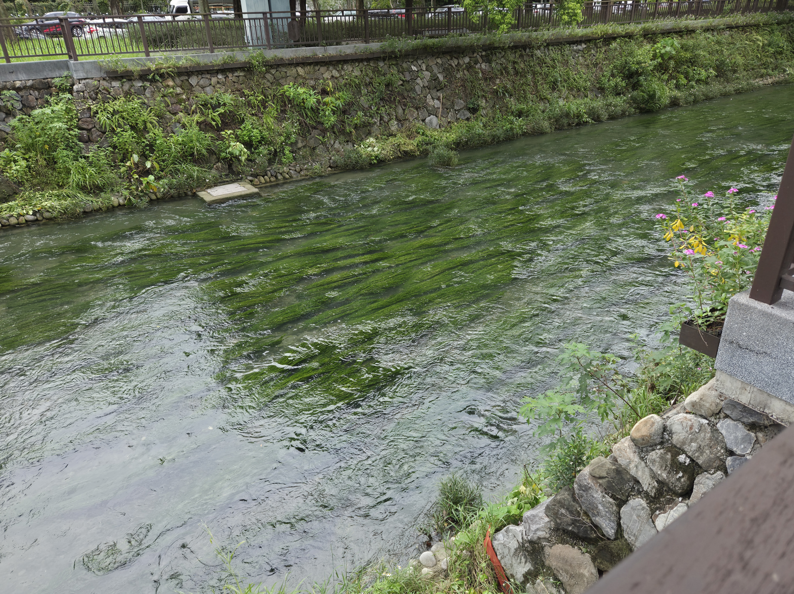

回到禮堂，哥哥好像因為司儀有飲料喝，但是好像多一杯 ( ? 我到現在都想不明白為什麼會多一杯，我猜是因為小隊輔有一杯，司儀也有一杯吧 ! 緊接著校園巡禮開始了，這種破冰我最討厭了，但好險好像沒有什麼太糟糕的事發生，而且其實解謎遊戲我覺得設計的很厲害，尤其是那個不能流於表面的那關，倒是跟我一組的人好像有一個是中國人...... 而且校園巡禮的路途中，我發現大學好像真的有很多外籍生。闖關遊戲結束後，聽了三個演講。第一個演講是永豐銀行的HR柯尹翔學姐，他的演講我覺得蠻受用的，而且他原本居然是做什麼動物相關科系的，很厲害。第三個是一個學長，但是我忘記他叫做什麼名字了，我只記得他主辦了 TED×NCHU 和讓我們折彈跳蛙，是說折彈跳蛙蠻有趣的。還有就是過程中學姐和學長開始會合我互動了，耶~~ 學長總是在鬧我，他們倆甚至問我老哥是不是 gay ，而學姐送了我一張抽獎卷，雖然到最後我什麼獎都沒抽到 〒▽〒
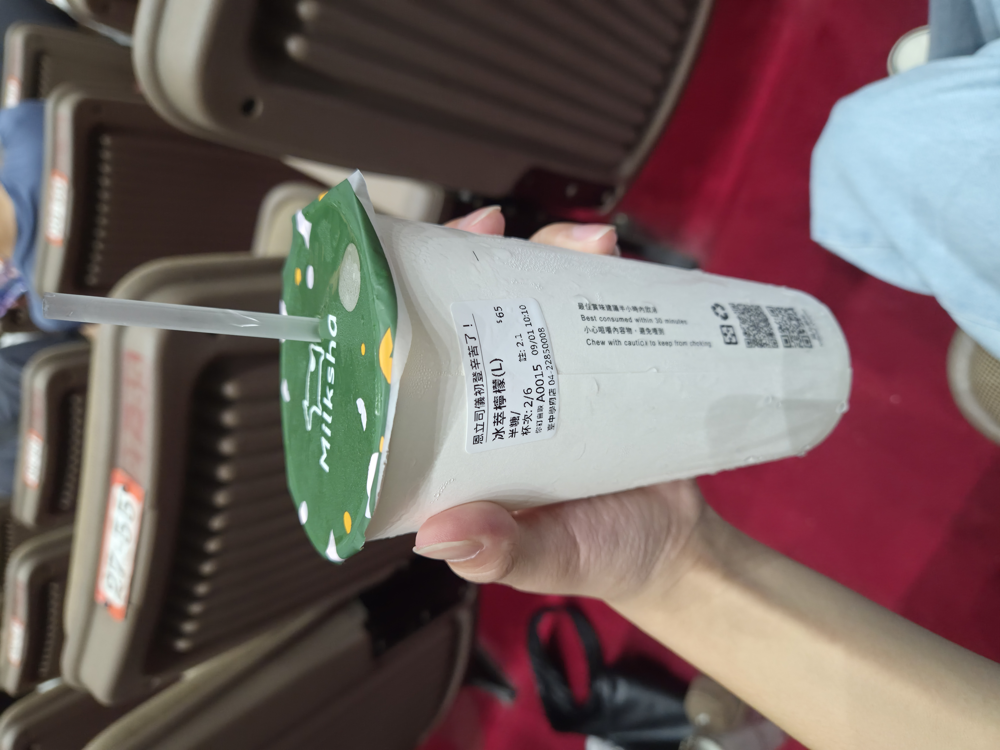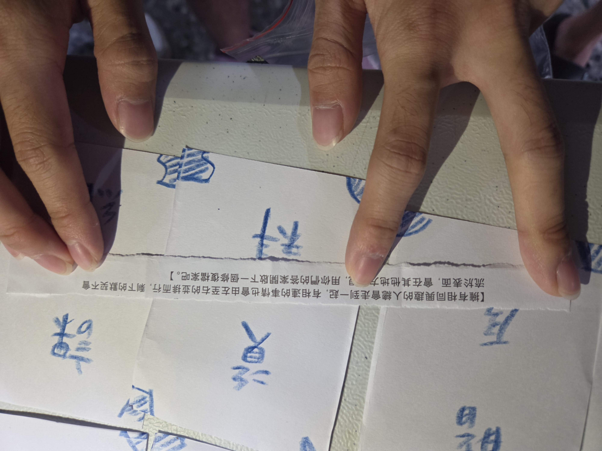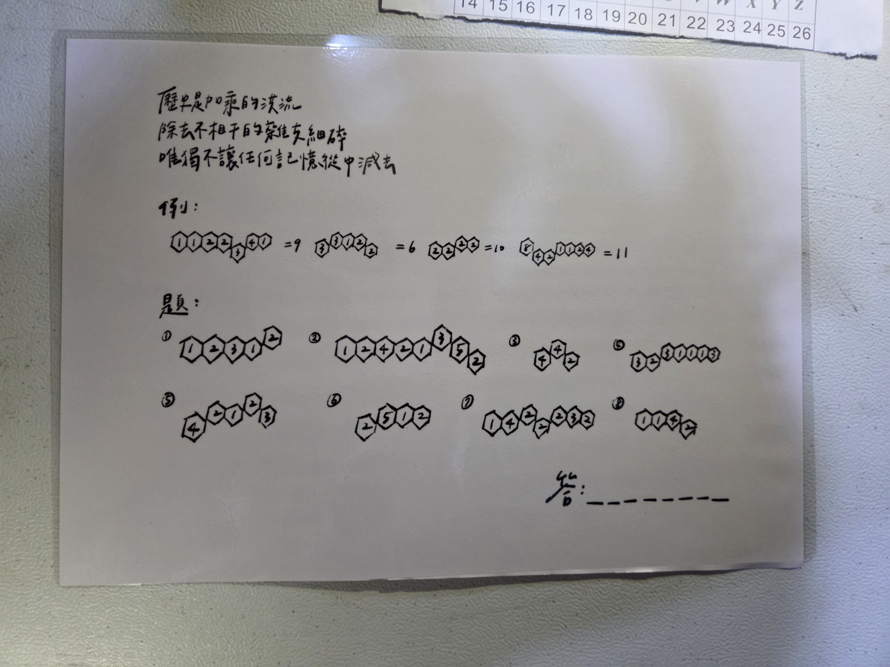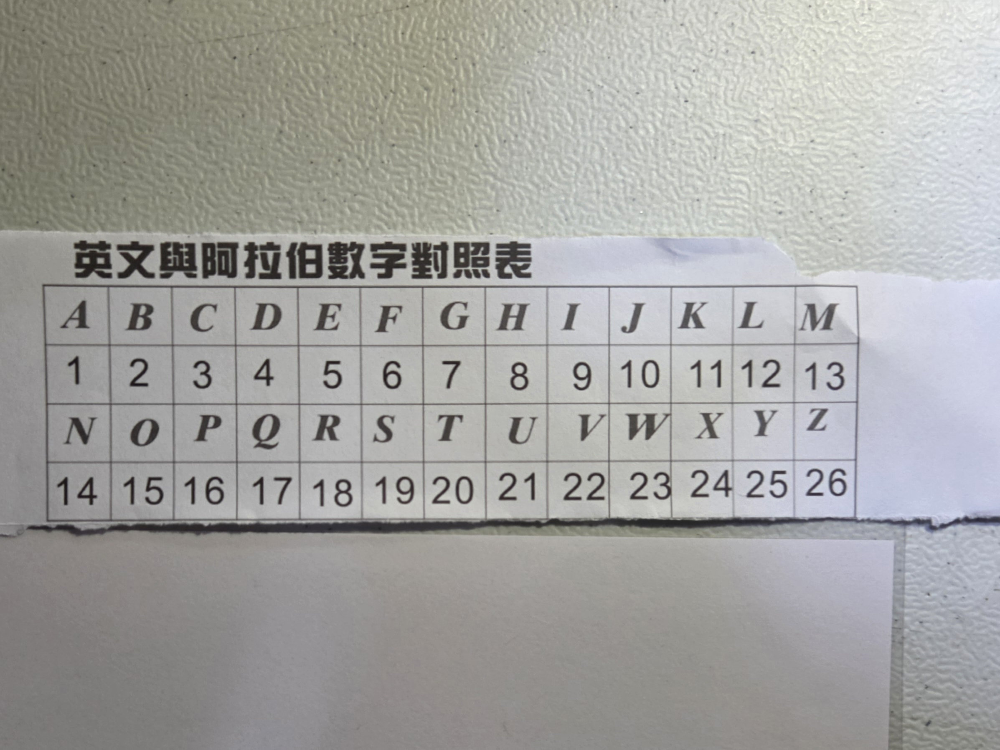
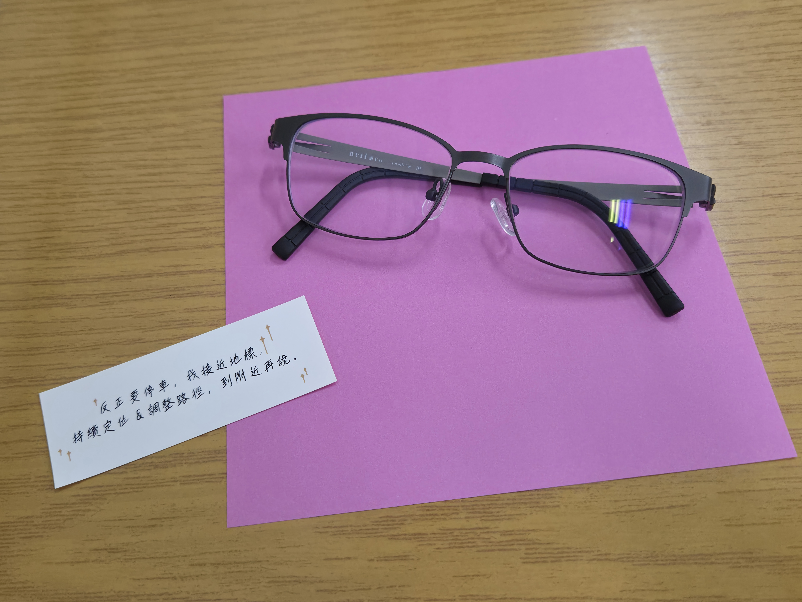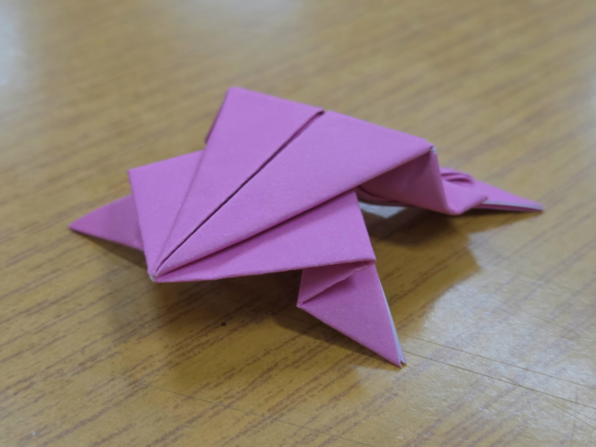

結束後和同學去吃了大門口對面的牛肉麵店，吃了今天唯一的一餐--白飯，還有就是去吃免費的珍珠和紅茶咖啡，其實我覺得珍珠還不錯但是同學都說不好吃。回程的時候，因為雨剛停很漂亮，所以拍了很多照片，中間有試著拍長曝光想要拍遮燈線，但是我覺得不好看，希望下次會更好。
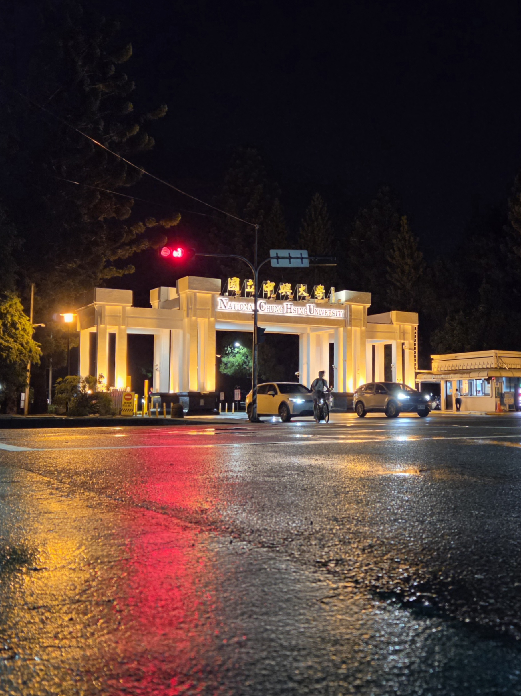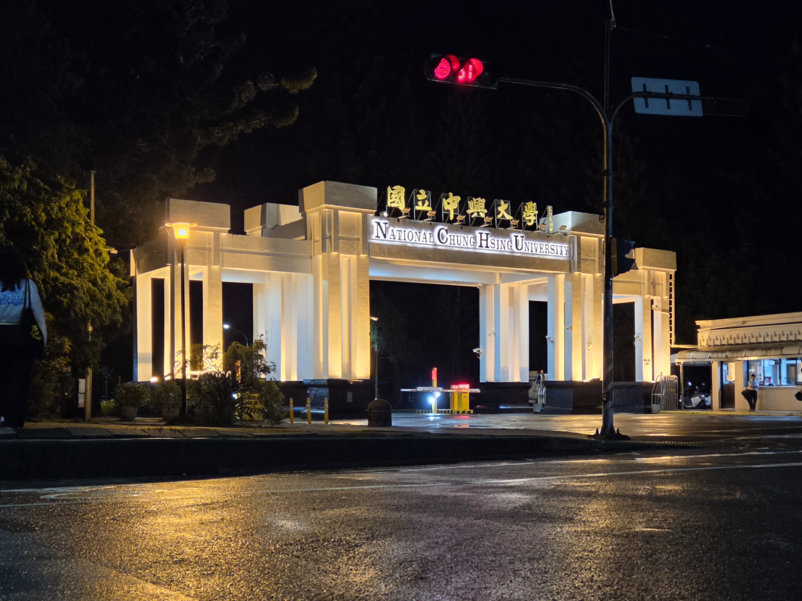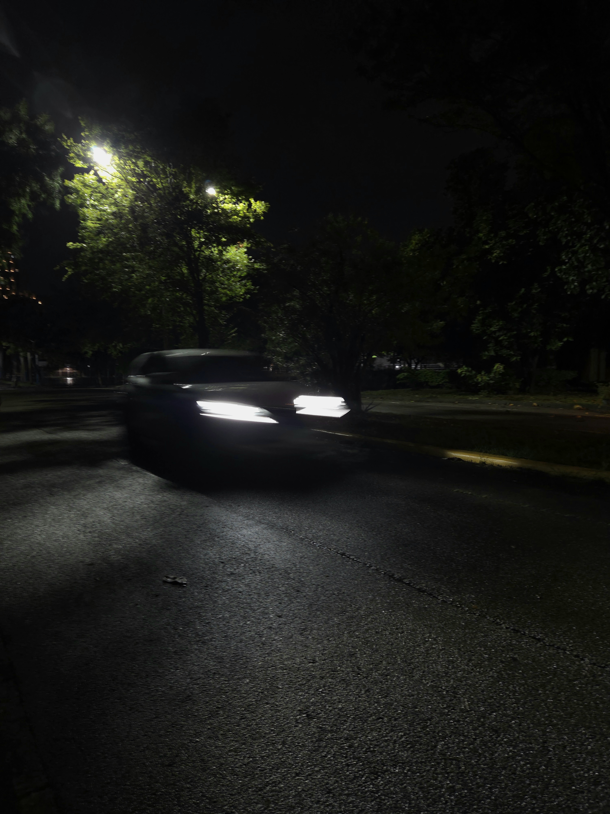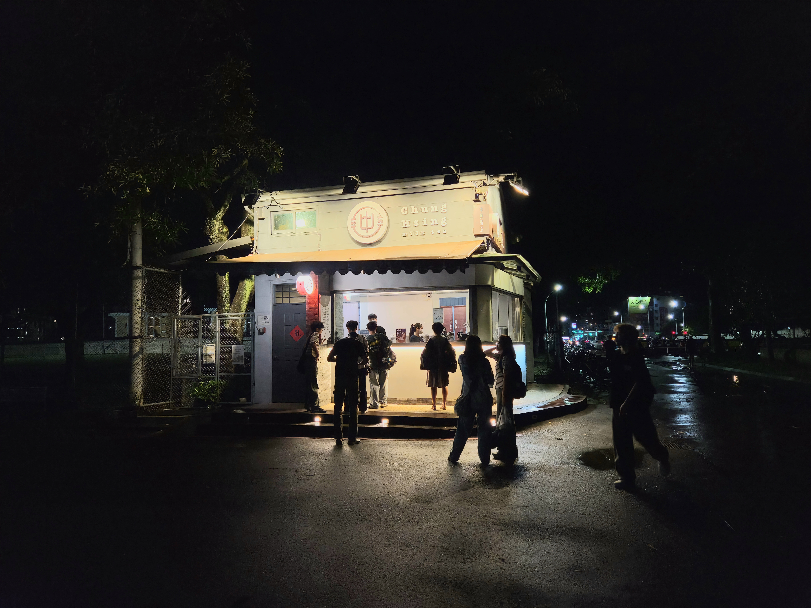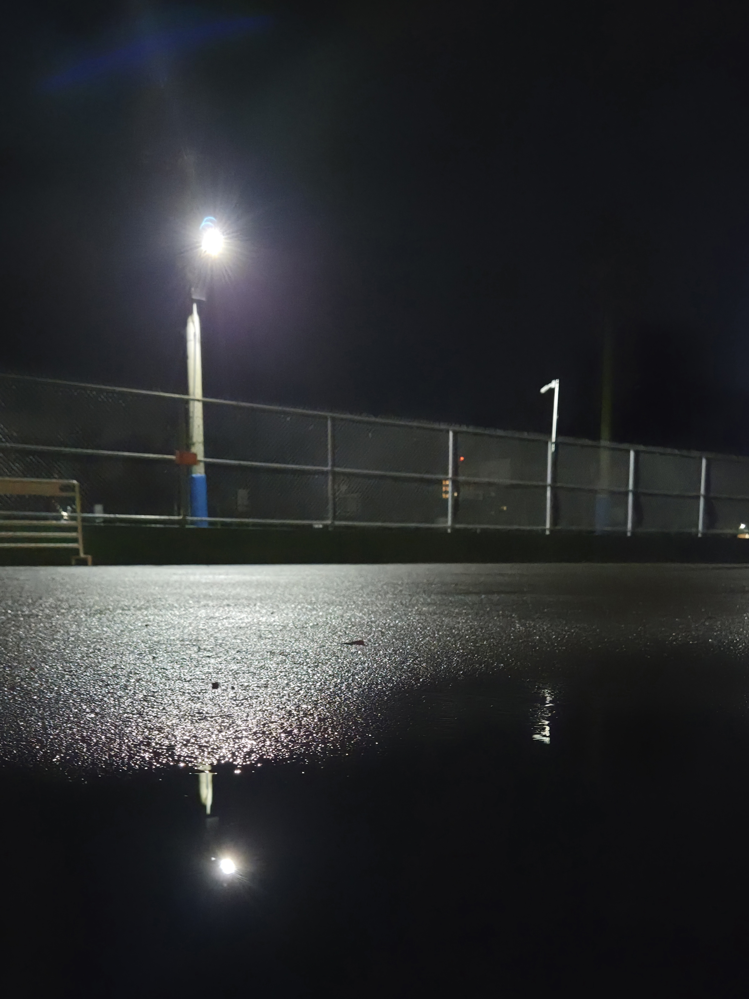

好了我要趕快去睡了，不然超級令人討人厭而且很北七，緊天要盡量趕快去睡。

