## 第一次去找素食餐廳吃飯
今天比較好早上有自己起來但是因為馬上就要去參加系上的迎新，我就沒有去吃早餐了，系上的迎新還算有趣，我有點想加系羽和系桌，系羽好像有點累，系桌比較 chill 的樣子，所以我應該是加系桌吧。哦然後，今天迎新就是一直聽一個老師一直吹我們系有多強多強，還有一個導師很老，上來都不知道在講什麼，哈哈哈蠻好笑的，其他老師都簡短帶過而已。
中午的時候，哥哥有幫我訂了素壽司，之後可以去吃，但是那些有素肉的也還是很難吃。中午後，室友先回家了，而我繼續去參加EMI和銜接課程的說明會，其實都蠻無聊的，聽完後超累的我就直接從大概下午4點睡到7點，起來整個人很茫，但想說難得自己一個人我就去找哥哥說可以吃得素食吃吃看吧 ! ( 當時鄭睿鈞和楊昊恩去參加飛盤社的迎新，楊昊恩每次有活動都不邀我，反正我應該跟他注定也不會成為很好的朋友吧 :/ )
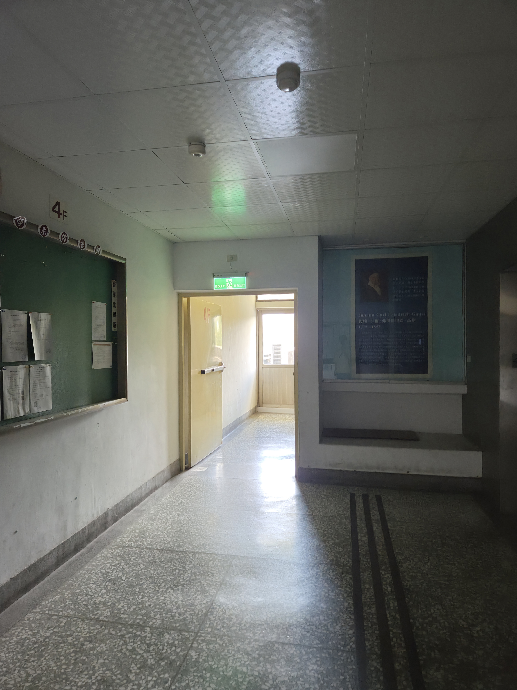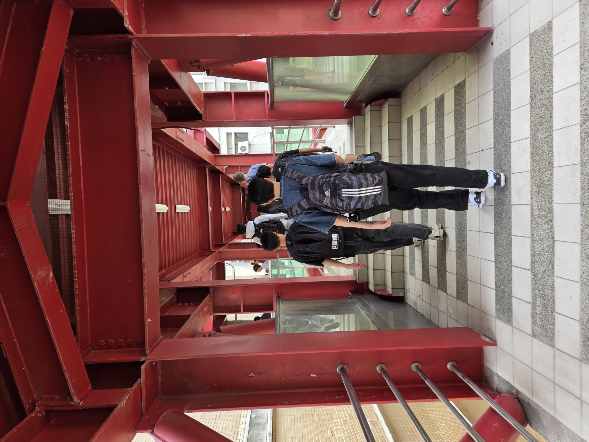

他的店外面長的真的很狂，哈哈哈哈，店裡面一直有一種我不喜歡的怪味，起司很多很好吃但是咖哩很甜，整個吃得我有點痛苦，下次點點看英國什麼野茄的還有他的冰沙吧，走回去的時候我就順路買了個薄荷糖和冰鎮犒賞自己
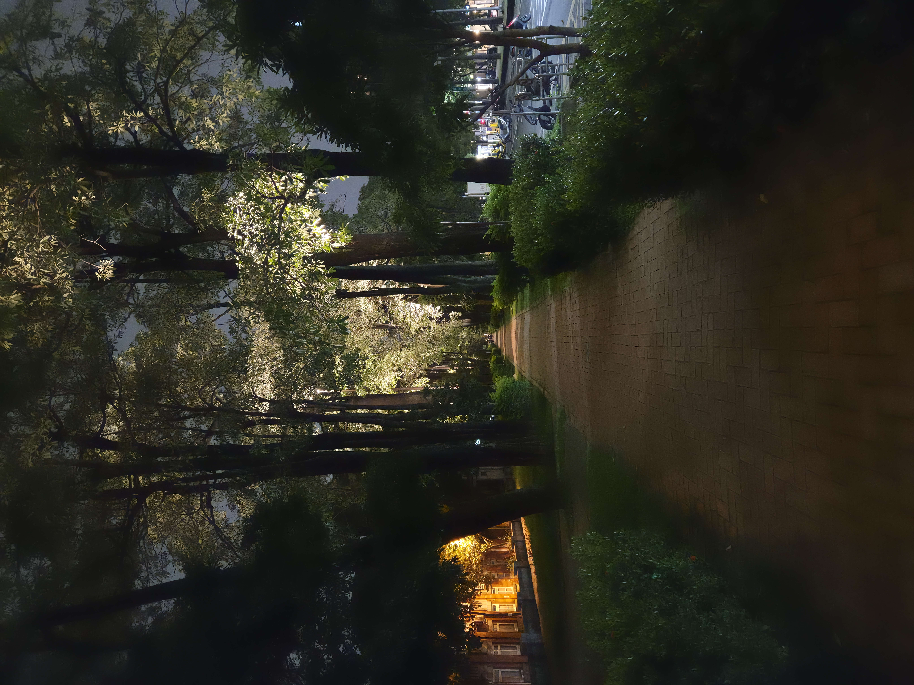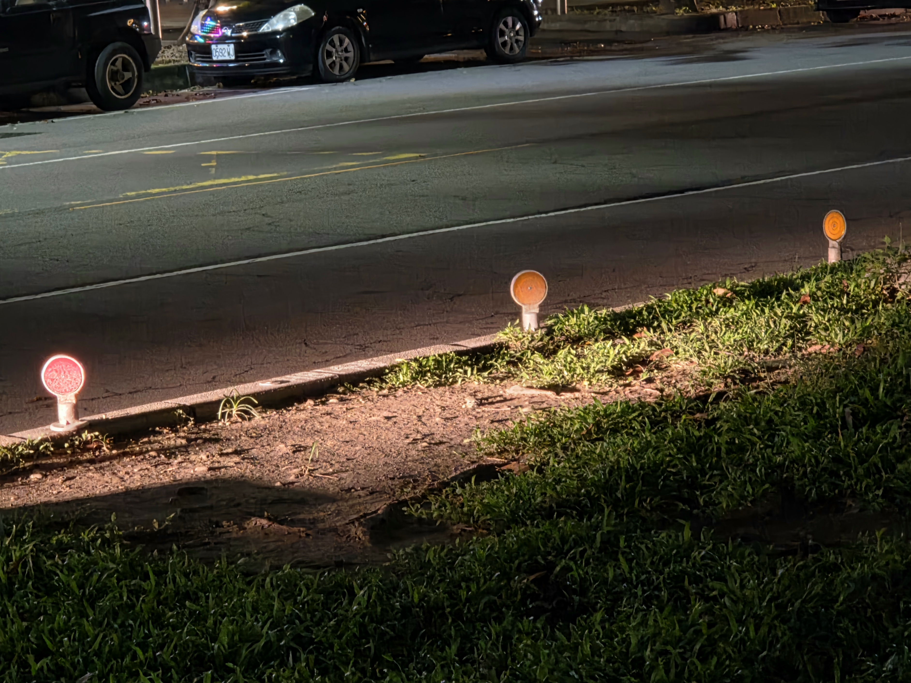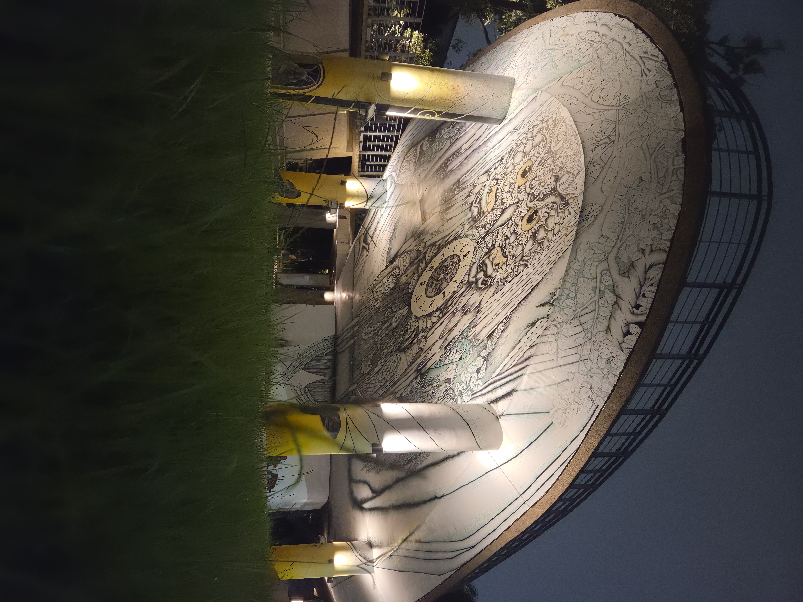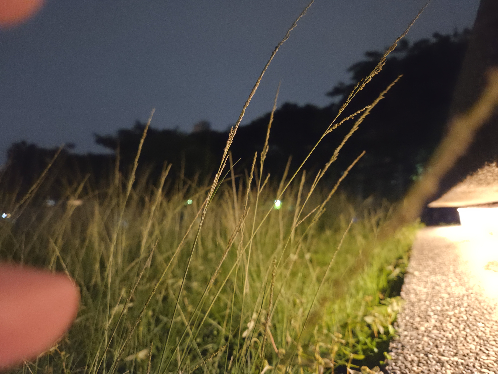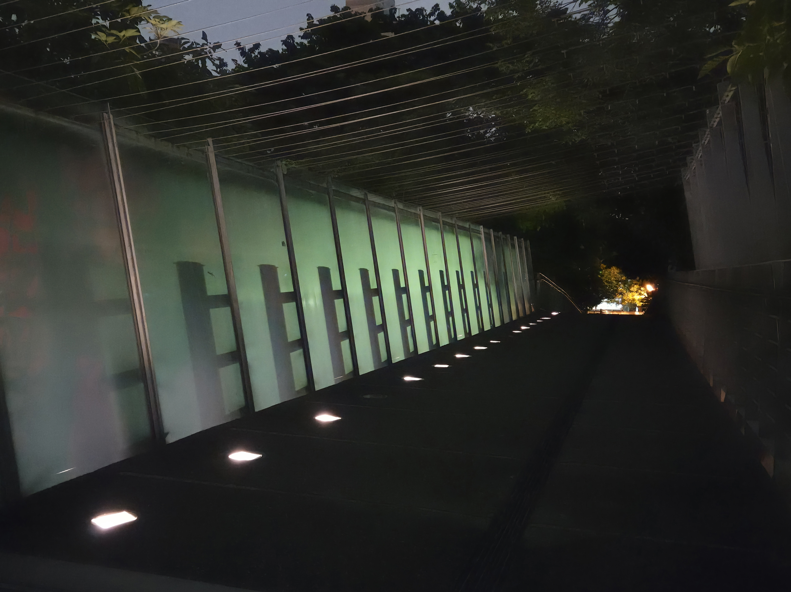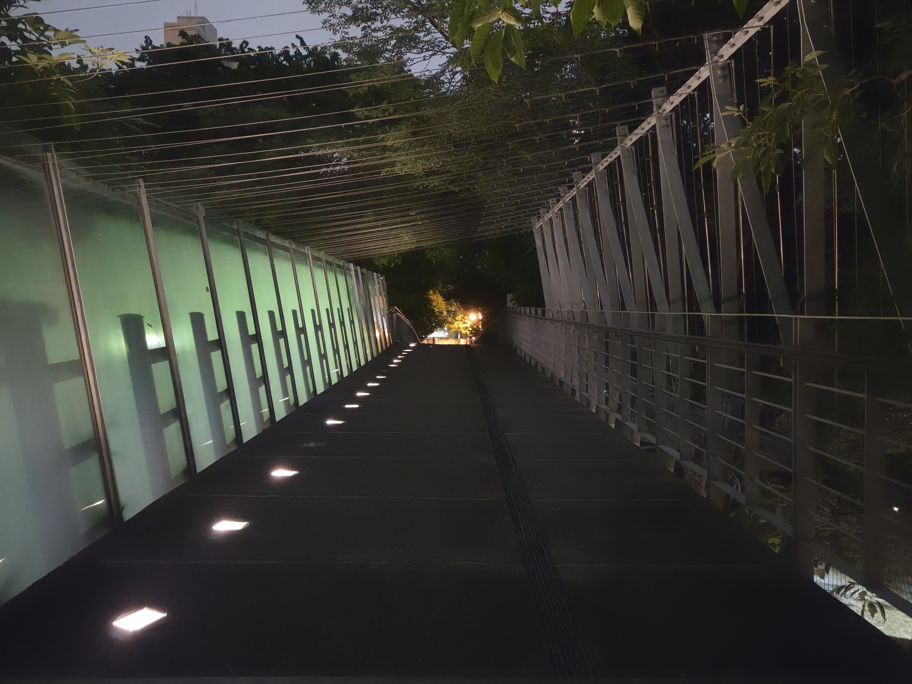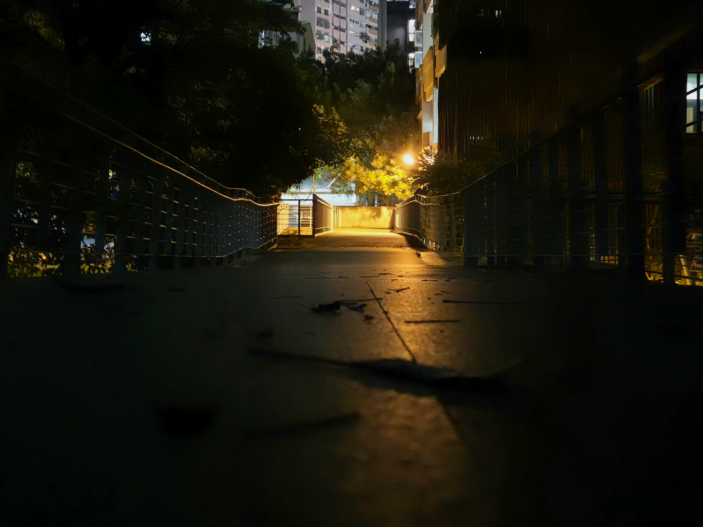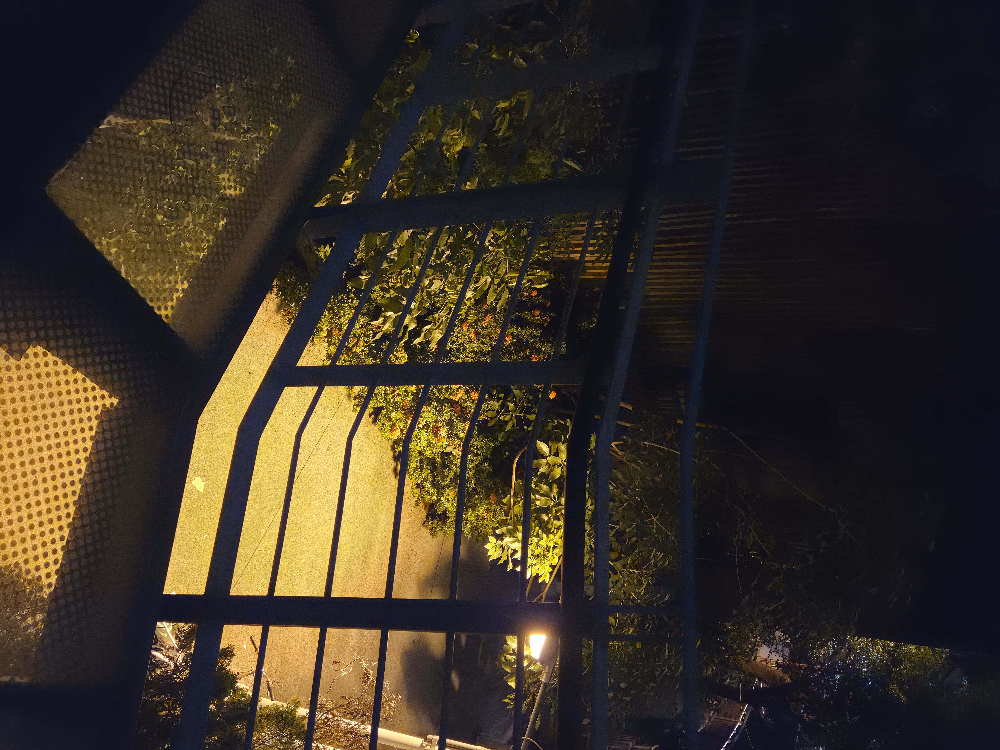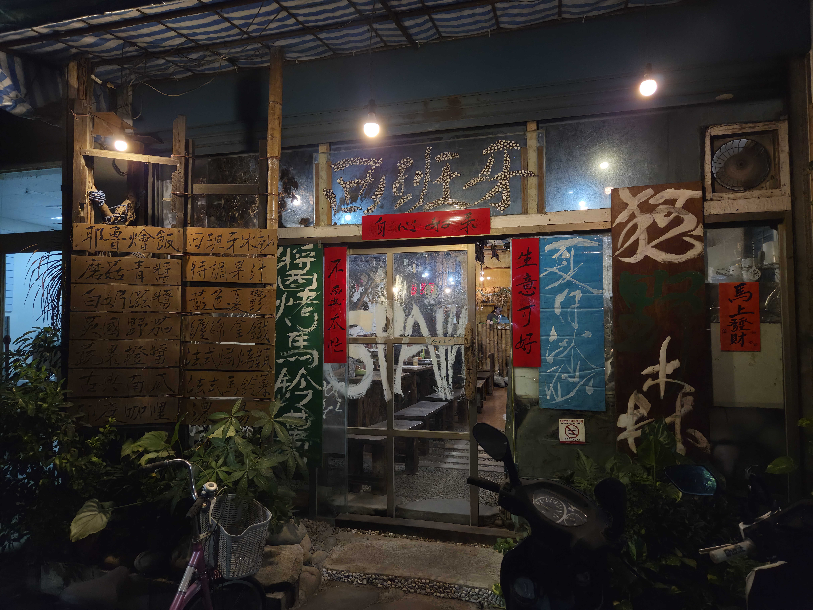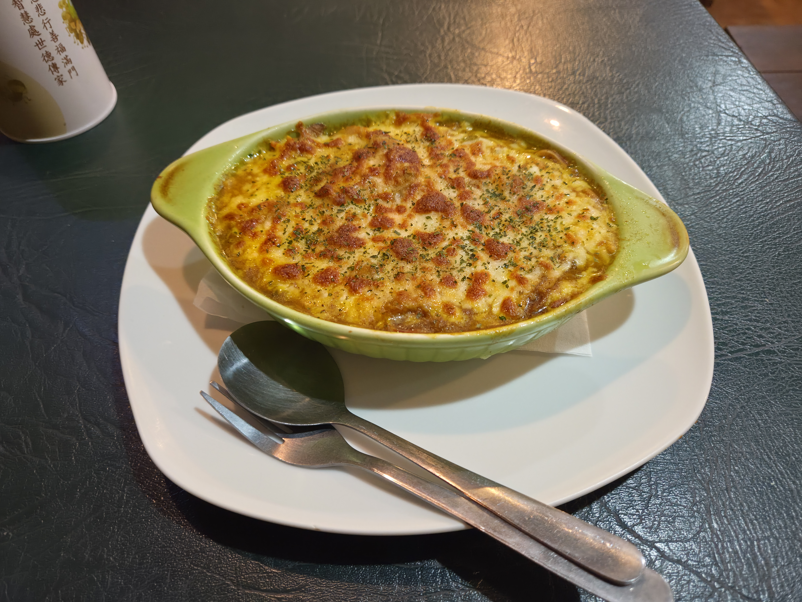

1:04