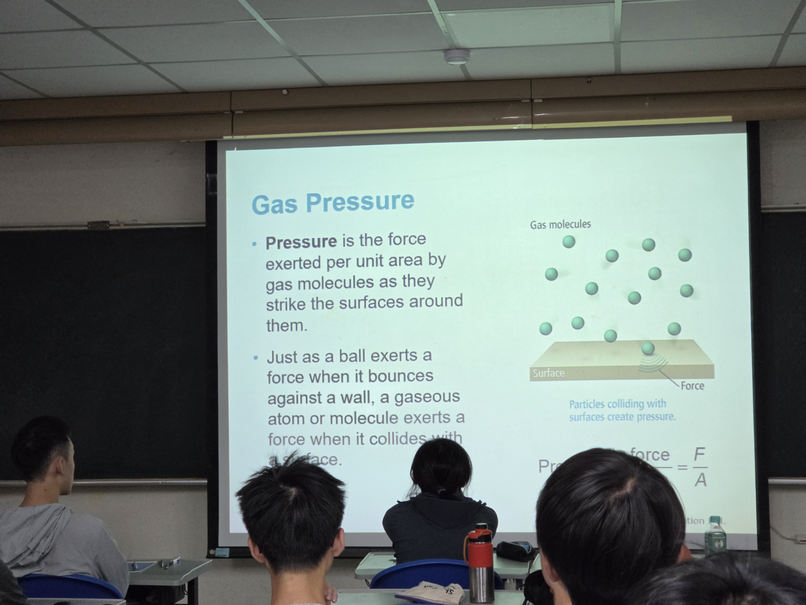
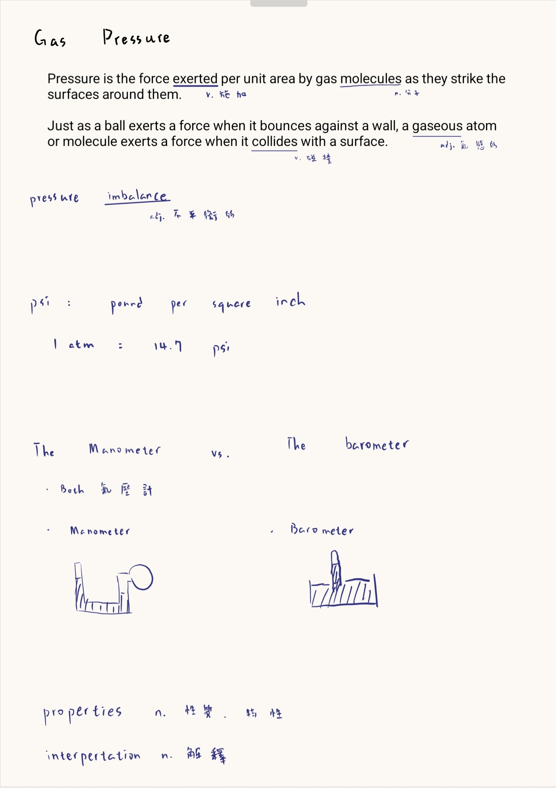
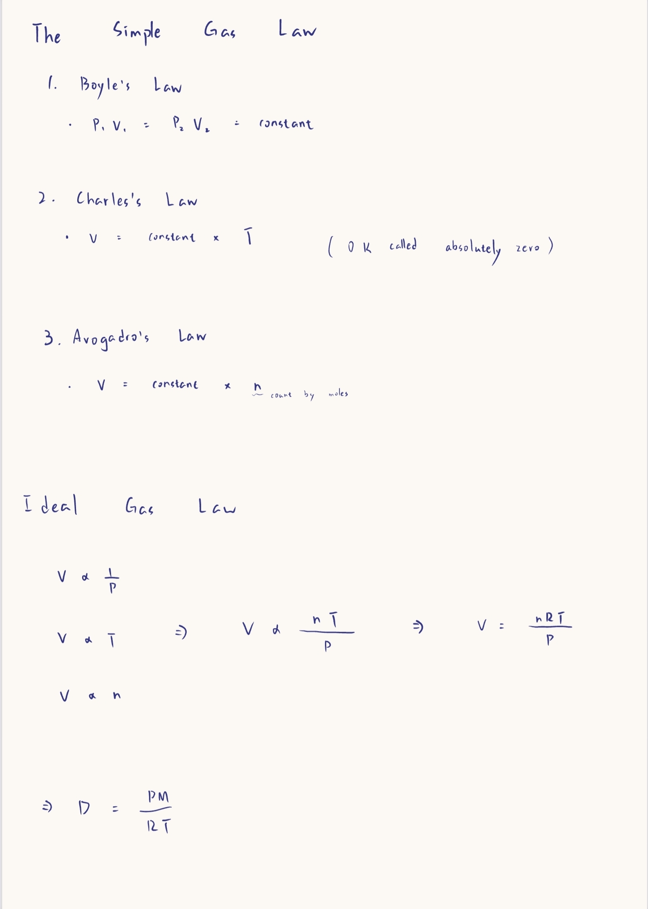
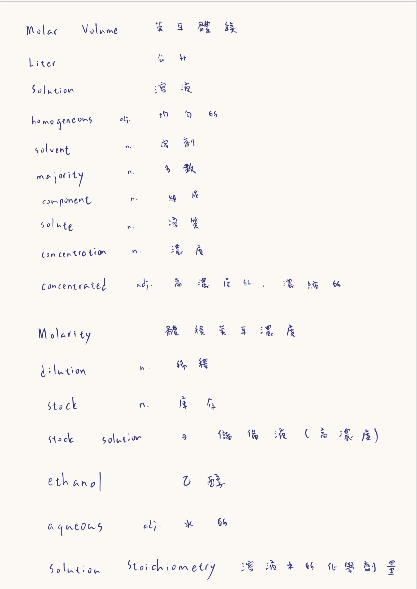
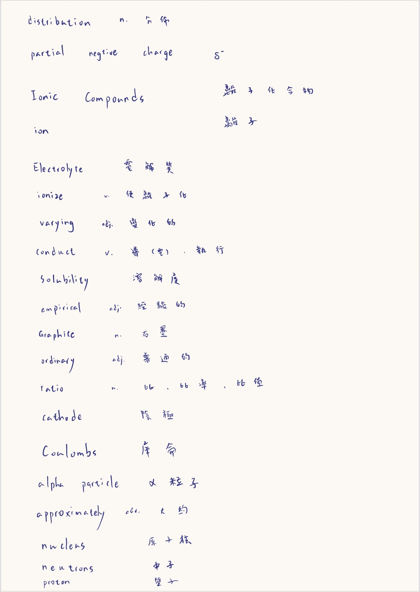
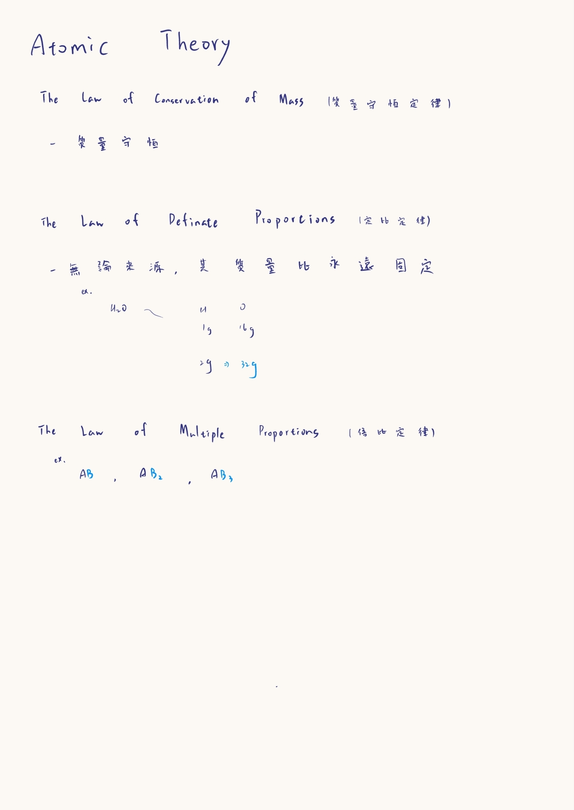

## 大學の第一堂課
今天一大早好險起的來，我訂了6點的鬧鐘我記得我好像是6點15起床的，8點我跟鄭睿鈞去吃了弘爺早餐店，我難得點了煎蛋吐司又點了一個薯餅。
差不多9點到了化學管的教室上課，我第一次用了平板做上課筆記，其實說實話 Notein 這款軟體真的很好用，但是匯出筆記的時候有浮水印，要訂閱，所以我打算明天換用 samsung note 試試看，我們中途10點的時候有搶課，我搶到了我想要的羽毛球課，希望到時候會好玩，室友沒搶到，他居然要去健身，我感覺他死定了。

我們中餐去吃 7-11，鄭睿鈞自己去旁邊買便當，等我 7-11 微波完後，我們就決定回宿舍吃，原本還有打算去買手搖飲來喝的，但是太多人了，所以就放棄了。吃完後我們就回去上課