## 從新竹回來惹
嗚嗚好想繼續待在家，我不想開學 ;w;

今天我九點自己爬起來，讓麻麻很驚訝，其實我自己也很驚訝，因為我昨天其實三四點才睡。起床後馬上我們就趕著去台中跟哥哥一起吃飯，拔拔選了一間菜市場中的店，說實話其實我覺得蠻好吃的，但是我全程臭臉，因為那個店有賣臭豆腐，真的是超級臭的，我以後不管是跟同學還是自己去吃飯都要注意一下那間店有沒有賣臭豆腐。哦對了，那時候我回去放書包看到人家褲子掉下來超好笑。
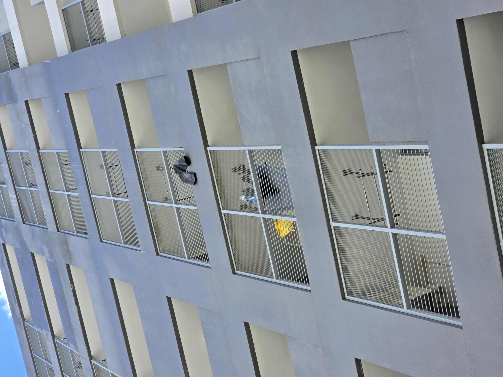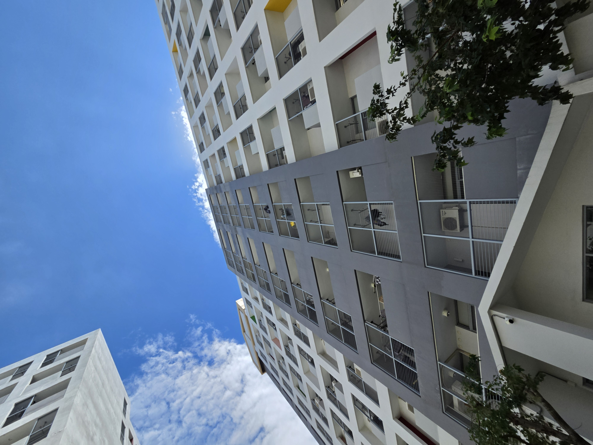

吃完飯後哥哥就回學校開會了，拔拔麻麻還想再跟我待一下所以我就隨著他們的意，去了國家漫畫博物館，說實話那完全超出我的想像，我原本以為會很無聊，但其實很有趣而且都事拔拔那個年代的漫畫，麻麻說他也有看過一些些，那裡我唯一看過的是刀劍神域，但是拔拔一直站在我後面不肯先出那個展，我不敢去翻開來看。那裡整個很 chill 賣的東西感覺也都很讚，我們買了兩份兩球冰淇淋，結果店員給了我們兩份冰淇淋 + 雞蛋糕的套餐，超好笑麻麻跟他說我們不是點套餐，他還點頭說對。那裡有一間書店居然有賣一本中興大學出版的書，我改天再去圖書館看，應該會有。旁邊還有賣衣個小紀念品，感覺可以自己做做看
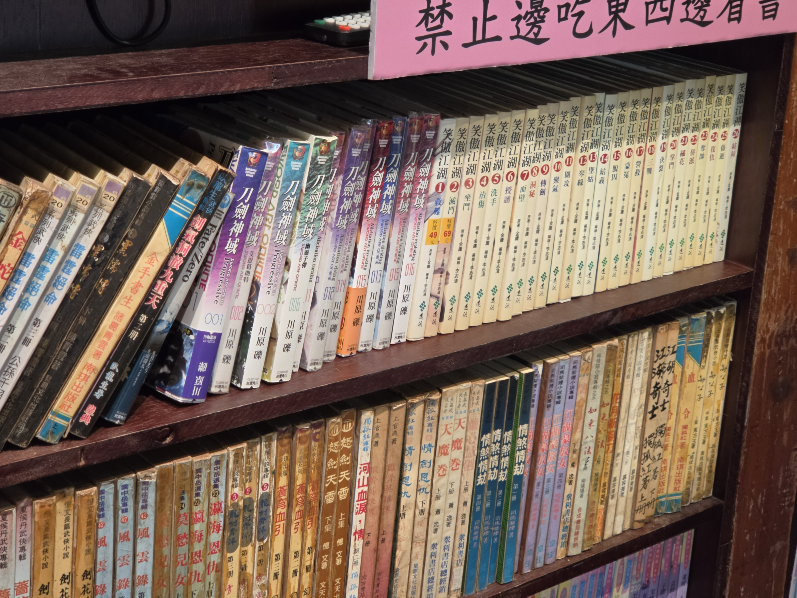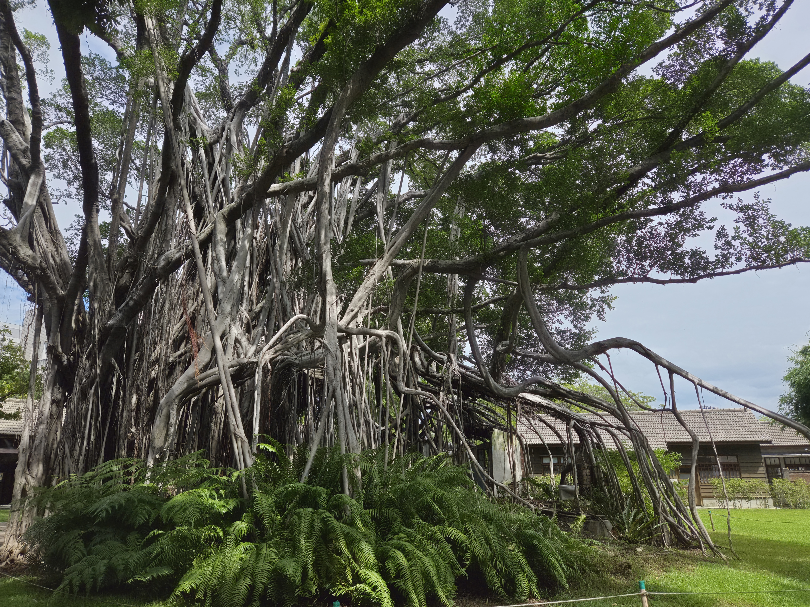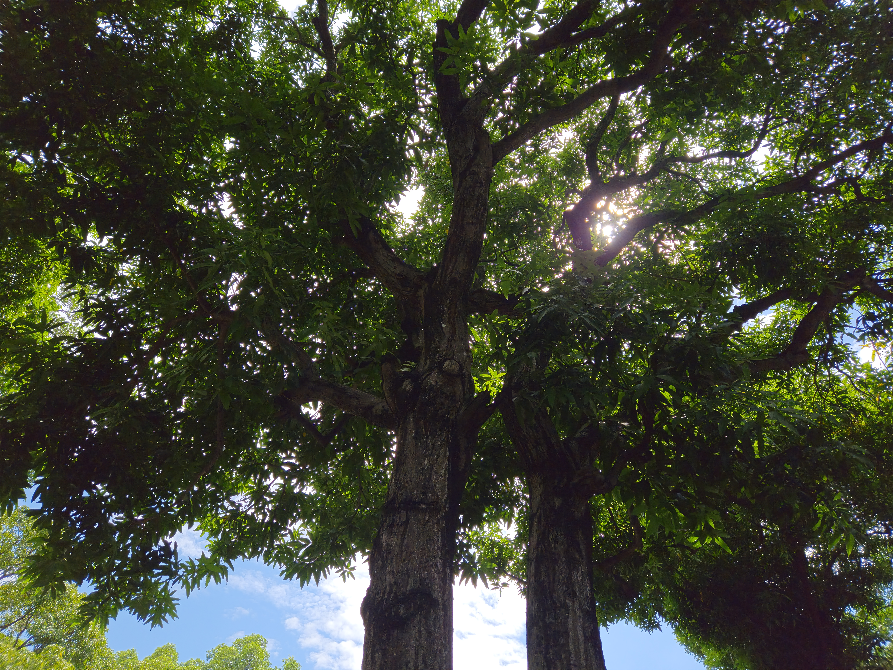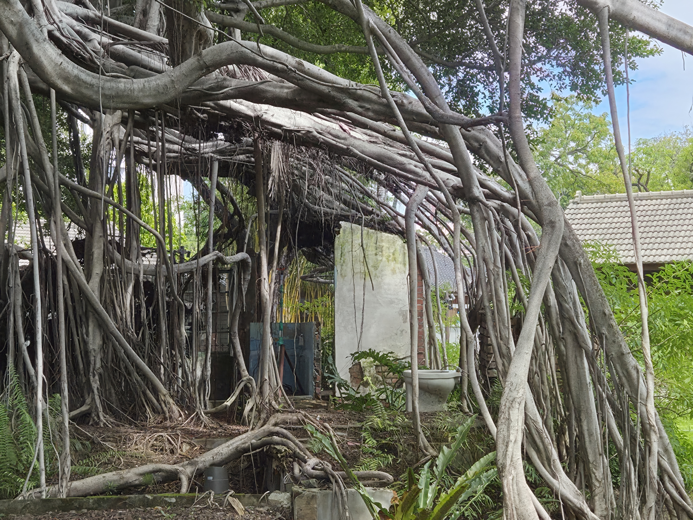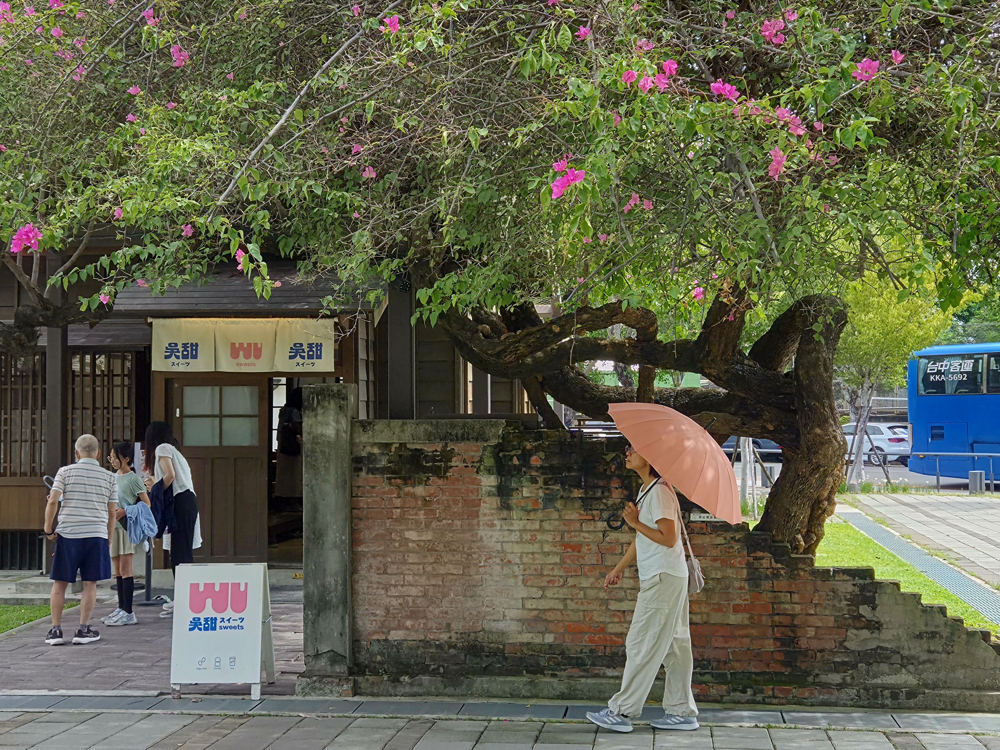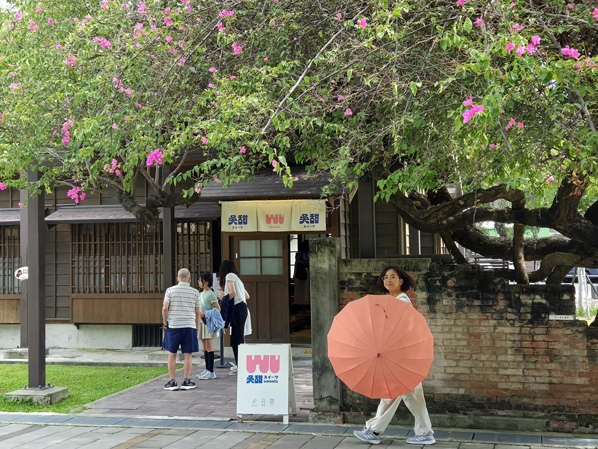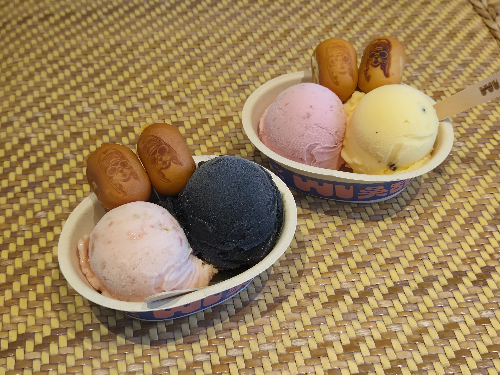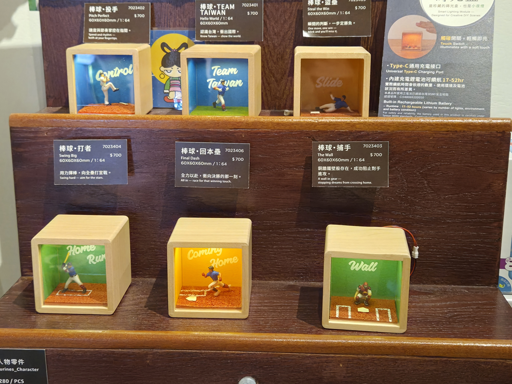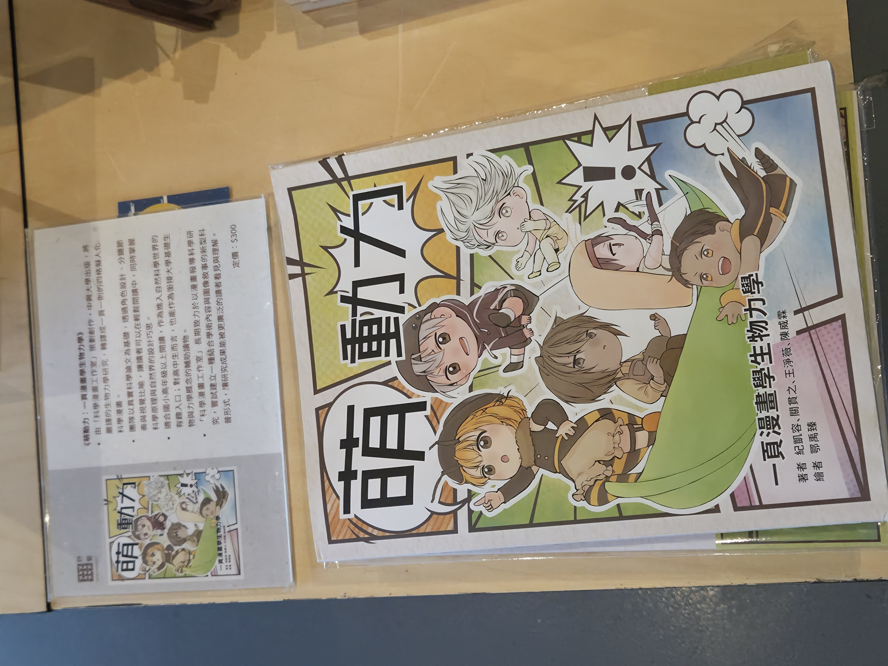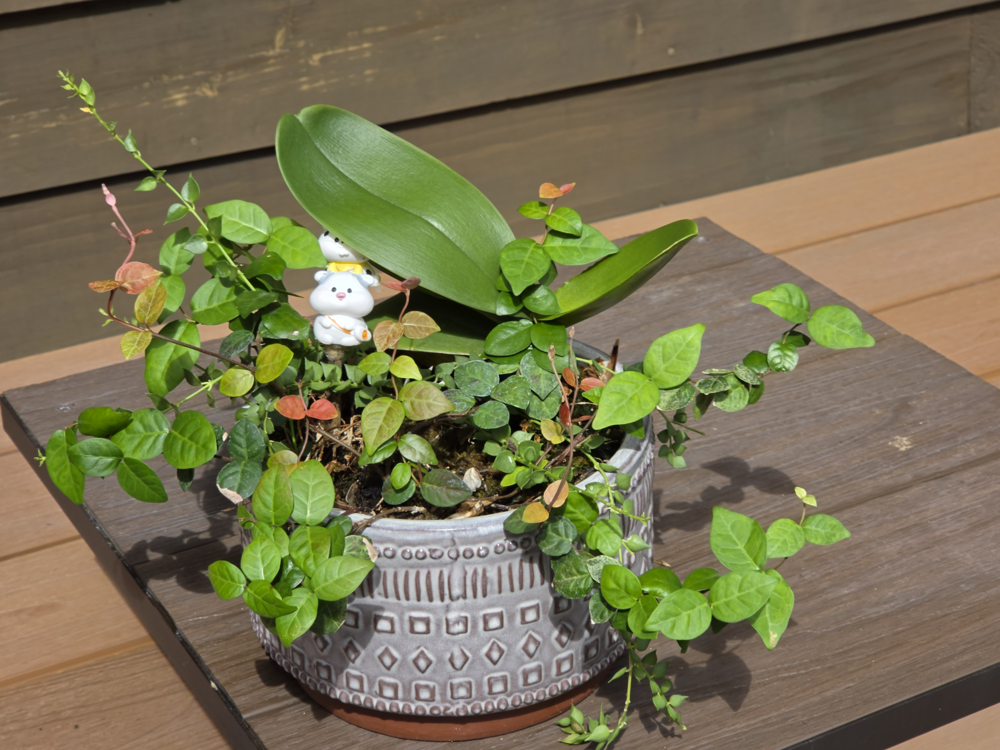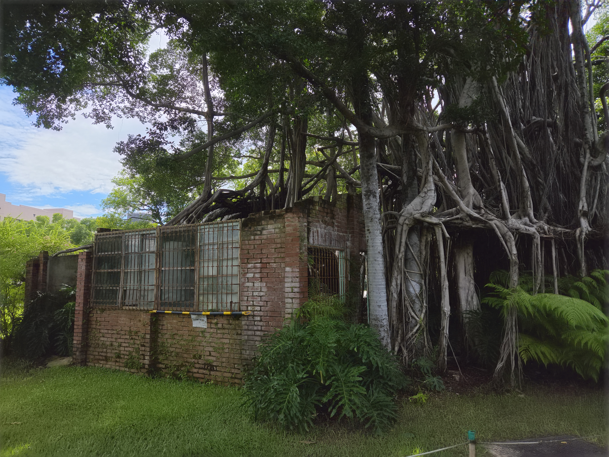

晚餐吃一間還不錯的店，我感覺普普通通但是拔拔麻麻很喜歡，但他的麵體不得不說真的很好吃。等麵的時候看到的影片，我覺得講得很好，蠻受用的，之後可以放進研究所的書審。
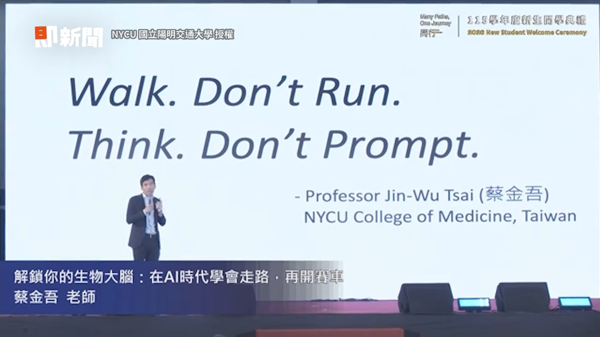