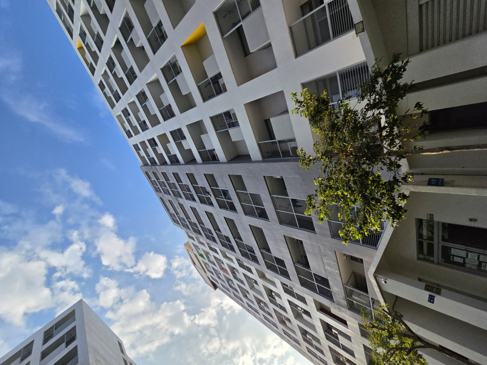
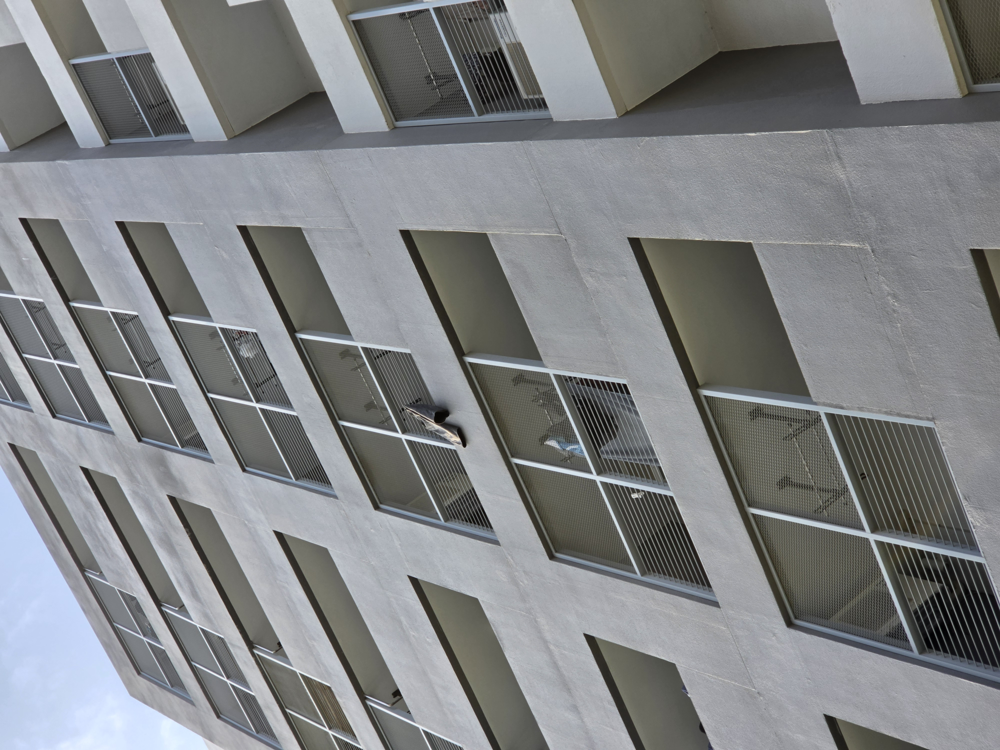
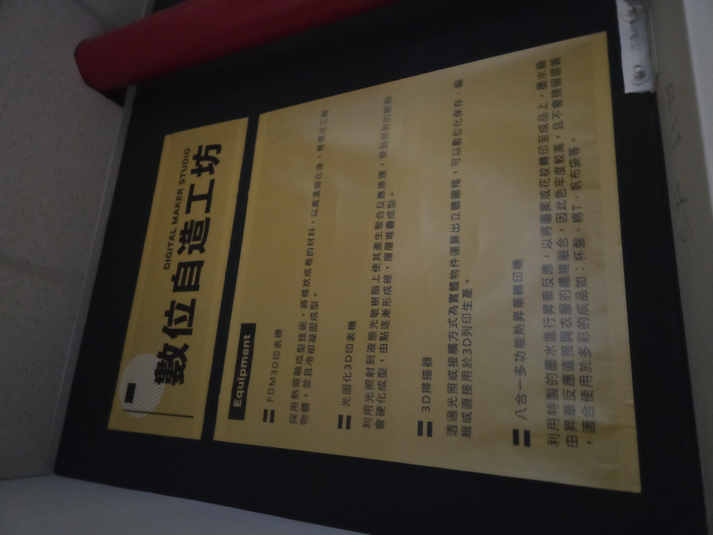

## 第一天開學 !!
今天也是6點就早早起床了，室友一早不知道是去幹嘛，我以為他是去吃早餐，所以在整理好自己後我就出門自己吃早餐了，到一樓的時候又發現了昨天就在的褲子，不知道他會住在那多久呢，結果在回宿舍的時候再一樓遇到室友正要出去吃早餐。

早上一早是上普物，我沒想到居然是EMI，而且說實話第一堂課這樣上下來，我覺得這個老師沒有很厲害，上完之後我就去圖書館逛逛順便直接讀到12點50再去上微積分課，差不多整點到居然同學都做滿了，雖然我也打算做前半排，但是我沒有打算做第一排啊 ( 結果弄到最後還不是跟物理一樣坐在最前面 ) 。微積分老師蠻不錯的，放學後我就跟著一個中國衣的大四學長一起問問題，是他去問的，我在旁邊聽聽，結果就加入了，說實話我有一大半都聽不太懂，但是跟同學和老師打好關西沒什麼壞處對吧。

上完課我又直接                                                         